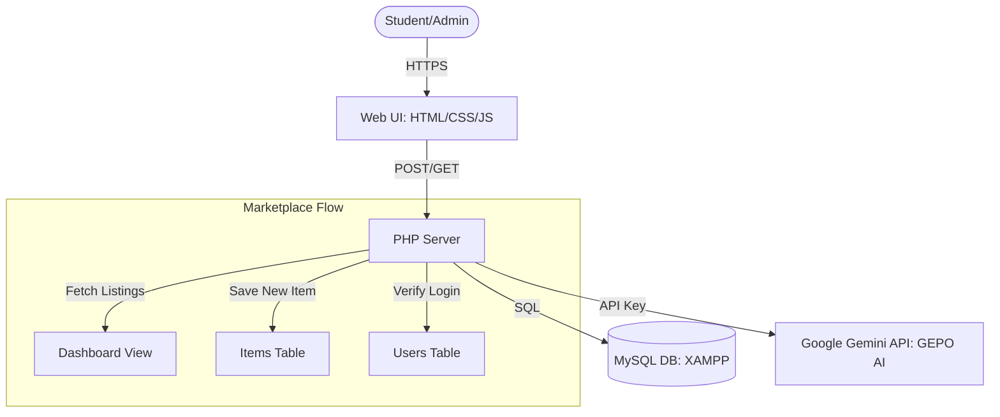

# UCLM GearLoop: Prototype Architecture

## System Diagram (High-Level)

## Component Integration
The prototype integrates three core components as required:
1.  **Frontend UI:** A responsive web interface styled with UCLM brand colors (Blue/Yellow).
2.  **Backend Logic:** PHP scripts handle session management, data validation, and database interactions.
3.  **Data Storage:** A MySQL database stores user profiles and marketplace listings, ensuring persistent data across sessions.

## Core Flow (End-to-End)
- **Step 1 (Request):** The student submits a "List an Item" form with resource details.
- **Step 2 (Process):** The PHP backend (`process-list-item.php`) receives the data and performs a SQL `INSERT`.
- **Step 3 (Storage):** Data is saved in the `items` table of `gearloop_db`.
- **Step 4 (Response):** The system redirects the user to the `dashboard.php`, where the new item is immediately fetched and displayed to all users.
